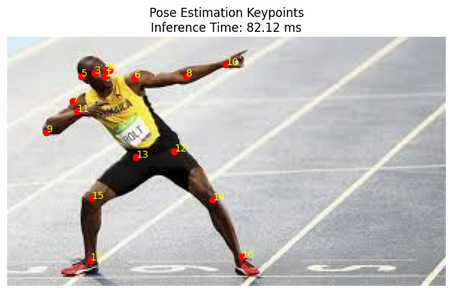

# Pose Estimation

## Project Overview
This project focuses on optimizing a TensorFlow Lite (TFLite) pose estimation model for mobile inference. It includes model quantization, inference on real images, and visualization of detected body keypoints.

The keypoints are mapped to body parts based on the COCO dataset format. This optimized model is lightweight and suitable for mobile devices with fast inference times.

---

## Key Features
- **TensorFlow Lite Model**: Pose estimation optimized for mobile inference.
- **Model Quantization**: Reducing model size for performance efficiency.
- **Inference Visualization**: Visualizing keypoints on input images.
- **Inference Time Measurement**: Measuring and reporting inference time in milliseconds.
- **Keypoint Mapping**: Mapping keypoints to body parts.
- **Google Colab Environment**: No setup required to run the code directly in Colab.

---

## Keypoint Mapping Table

| **Keypoint Number** | **Body Part**       |
|---------------------|---------------------|
| 1                   | Nose               |
| 2                   | Left Eye           |
| 3                   | Right Eye          |
| 4                   | Left Ear           |
| 5                   | Right Ear          |
| 6                   | Left Shoulder      |
| 7                   | Right Shoulder     |
| 8                   | Left Elbow         |
| 9                   | Right Elbow        |
| 10                  | Left Wrist         |
| 11                  | Right Wrist        |
| 12                  | Left Hip           |
| 13                  | Right Hip          |
| 14                  | Left Knee          |
| 15                  | Right Knee         |
| 16                  | Left Ankle         |
| 17                  | Right Ankle        |

---

## Setup Instructions

### 1. Open Google Colab
- Simply open [Google Colab](https://colab.research.google.com/).

### 2. Upload Files
- Upload your **TensorFlow Lite model** (e.g., `model.tflite`) and **input image** (e.g., `image.jpg`) directly to Colab via the sidebar.

### 3. Install Required Libraries
Run the following command to install the necessary libraries:
```python
!pip install tensorflow numpy matplotlib opencv-python tabulate
```

### 4. Run the Code in Colab
Copy the code provided below into Colab cells.
Make sure to upload the model.tflite and real_image.jpg before running the code

```python
import tensorflow as tf
import cv2
import numpy as np
import matplotlib.pyplot as plt
import time

# Load the input image
image_path = "/content/image.jpg"  # Path to the uploaded image
image = cv2.imread(image_path)
image_rgb = cv2.cvtColor(image, cv2.COLOR_BGR2RGB)  # Convert BGR to RGB for display

# Resize the image to the model's required input size
input_image = cv2.resize(image_rgb, (256, 256))
input_image_normalized = np.array(input_image, dtype=np.int32).reshape(1, 256, 256, 3)

# Load the model
model_path = "/content/model.tflite"  # Path to the uploaded TFLite model
interpreter = tf.lite.Interpreter(model_path=model_path)
interpreter.allocate_tensors()

# Get input and output details
input_details = interpreter.get_input_details()
output_details = interpreter.get_output_details()

# Set input tensor and measure inference time
interpreter.set_tensor(input_details[0]['index'], input_image_normalized)

start_time = time.time()
interpreter.invoke()
end_time = time.time()

# Calculate inference time
inference_time = (end_time - start_time) * 1000  # Convert to milliseconds
print(f"Inference Time: {inference_time:.2f} ms")

# Retrieving output keypoints
output_data = interpreter.get_tensor(output_details[0]['index'])[0][0]  # Shape: (17, 3)

# Denormalize keypoints back to original image size
height, width, _ = image.shape
keypoints = []
for y, x, confidence in output_data:
    keypoints.append((int(x * width), int(y * height)))  # Scale back to original size

# Plot the image with keypoints
plt.figure(figsize=(8, 8))
plt.imshow(image_rgb)
for i, (x, y) in enumerate(keypoints):
    plt.scatter(x, y, c='red', s=40)  # Show keypoints as red dots
    plt.text(x, y, f'{i+1}', color='yellow', fontsize=10)  # Label keypoints with numbers
plt.axis('off')
plt.title(f"Pose Estimation Keypoints\nInference Time: {inference_time:.2f} ms")
plt.show()

```

---

## Example Output


---

## Technologies Used
- **Python**: Core programming language.
- **TensorFlow Lite**: Model optimization and inference.
- **OpenCV**: Image processing.
- **Matplotlib**: Visualization of keypoints.
- **NumPy**: Array and tensor manipulation.
- **Tabulate**: Tabular display for keypoint mapping.

---

## Results
- The optimized TFLite model enables fast inference on mobile devices.
- Keypoints are detected with high accuracy and visualized clearly on input images.
- Average inference time: ~80 ms (depending on hardware).

